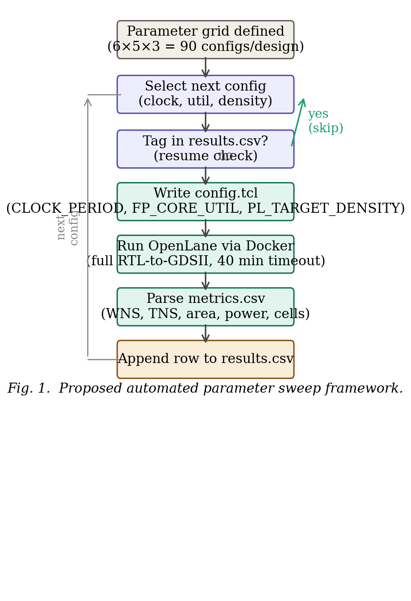
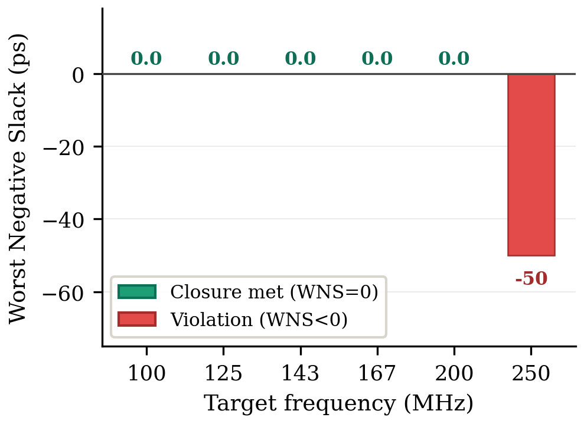
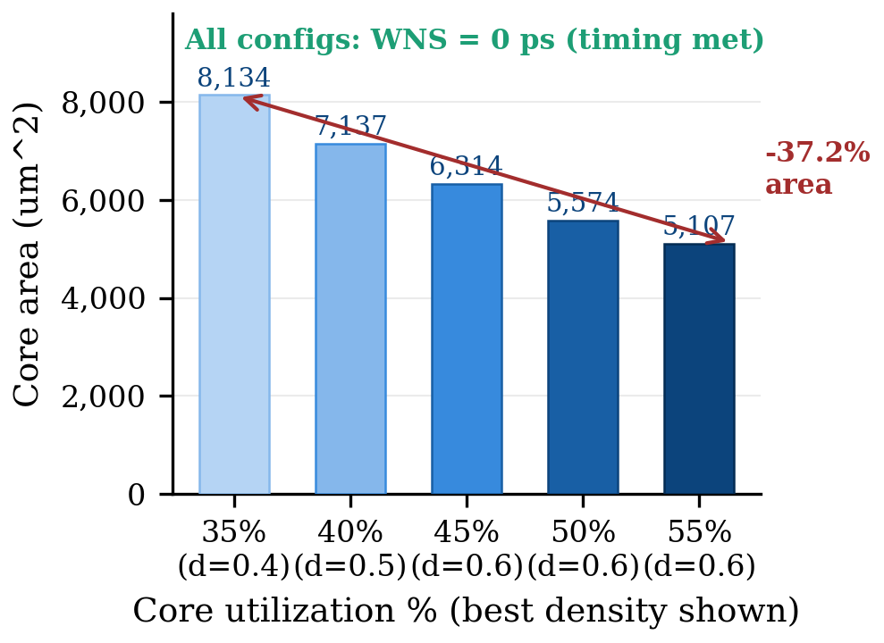
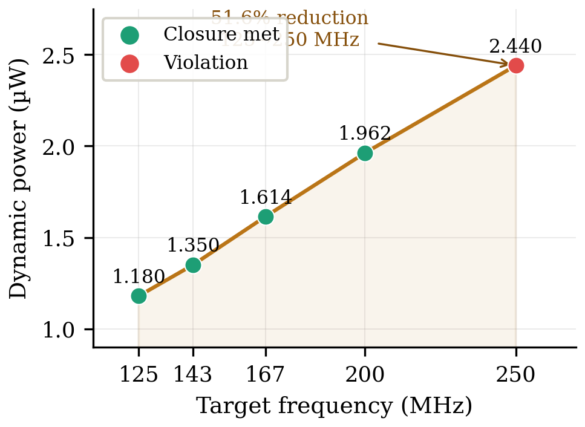

# Automated Parameter Tuning for Timing Closure in OpenROAD/OpenLane
### A Grid Search Framework on the SkyWater 130 nm PDK

<p align="center">
  <a href="https://a1vi.github.io/openlane-gridsearch-paper/paper.pdf"></a>
  <a href="https://a1vi.github.io/openlane-gridsearch-paper/"></a>
  
  
  
</p>

---

## 📖 Abstract

Timing closure in open-source RTL-to-GDSII flows requires iterative manual adjustment of physical design parameters — a process that is time-consuming and experience-dependent. This paper presents an **automated grid search framework** that systematically explores the parameter space of the OpenROAD/OpenLane flow targeting the SkyWater 130 nm PDK (SKY130A).

The framework varies three key configuration parameters — clock period, core utilization, and placement density — across a structured **6×5×3 grid**, executing each combination as a complete RTL-to-GDSII run. Experiments on the *spm* benchmark reveal:

- A sharp **timing closure boundary at 200 MHz** (all 15 configs pass; all 15 at 250 MHz fail)
- A **37.2% area reduction** by increasing core utilization from 35% → 55%
- **51.6% dynamic power reduction** from 250 MHz → 125 MHz (near-linear scaling)

---

## 🎯 Key Contributions

| # | Contribution |
|---|-------------|
| 1 | **Automated grid search** — Python-based orchestration of 90 full OpenLane Docker runs, zero human intervention, with fault-tolerant resume support |
| 2 | **Metrics extraction pipeline** — Parses WNS, TNS, post-SPEF WNS, area, cell count, critical path delay, and power to CSV after each run |
| 3 | **Quantitative timing–area–power characterization** of the *spm* benchmark on SKY130A across the full 6×5×3 parameter space |
| 4 | **Open-source release** of all sweep scripts, configuration files, and raw results for full reproducibility |

---

## 📈 Experimental Results

### Timing Closure Boundary

| Clock (ns) | Frequency (MHz) | Best WNS (ps) | Area (μm²) | Status |
|:----------:|:---------------:|:-------------:|:----------:|:------:|
| 10.0 | 100 | 0.0 | 7,136 | ✅ **Closed** |
| 8.0 | 125 | 0.0 | 8,134 | ✅ **Closed** |
| 7.0 | 143 | 0.0 | 8,134 | ✅ **Closed** |
| 6.0 | 167 | 0.0 | 8,134 | ✅ **Closed** |
| 5.0 | 200 | 0.0 | 8,134 | ✅ **Closed** |
| 4.0 | 250 | **−50** | 5,107–8,134 | ❌ **All Fail** |

### Area–Power Tradeoff at 200 MHz

| Util. (%) | Density | WNS (ps) | Area (μm²) | Power (μW) |
|:---------:|:-------:|:---------:|:----------:|:----------:|
| 35 | 0.4 | 0.0 | 8,134 | 1.962 |
| 40 | 0.5 | 0.0 | 7,137 | 1.942 |
| 45 | 0.6 | 0.0 | 6,314 | 1.956 |
| 50 | 0.6 | 0.0 | 5,574 | 1.919 |
| 55 | 0.6 | 0.0 | **5,107** | 1.942 |

> **37.2% area reduction** from 35% → 55% utilization while maintaining WNS = 0.0 ps ✅

---

## 🖼️ Figures

<p align="center">
  
  &nbsp;
  
</p>
<p align="center">
  <em>Fig. 1 — Automated parameter sweep framework &nbsp;&nbsp;&nbsp;&nbsp; Fig. 2 — Best WNS per target frequency</em>
</p>

<p align="center">
  
  &nbsp;
  
</p>
<p align="center">
  <em>Fig. 3 — Area vs. utilization at 200 MHz &nbsp;&nbsp;&nbsp;&nbsp; Fig. 4 — Dynamic power vs. operating frequency</em>
</p>

---

## ⚙️ Parameter Search Space

| Parameter | Values | Count |
|-----------|--------|:-----:|
| `CLOCK_PERIOD` | 4.0, 5.0, 6.0, 7.0, 8.0, 10.0 ns | 6 |
| `FP_CORE_UTIL` | 35%, 40%, 45%, 50%, 55% | 5 |
| `PL_TARGET_DENSITY` | 0.4, 0.5, 0.6 | 3 |

**Total**: 6 × 5 × 3 = **90 unique configurations**, each a complete RTL-to-GDSII run.

---

## 🛠️ Tool Environment

- **OpenLane** v1.0.2 (commit `ff5509f`) with SKY130A PDK
- **Standard cell library**: `sky130_fd_sc_hd` (high-density)
- **Host**: Ubuntu 22.04, Intel CPU, 16 GB RAM
- **Orchestration**: Python 3.8 via `subprocess.run()` Docker invocations

---

## 📦 Repository Contents

```
├── main.tex              # LaTeX source of the paper
├── paper.pdf             # Compiled paper (PDF)
├── fig1_framework.png    # Framework flow diagram
├── fig2_wns_freq.png     # WNS vs. frequency results
├── fig3_area_util.png    # Area vs. utilization at 200 MHz
├── fig4_power_freq.png   # Power vs. frequency scaling
├── index.html            # GitHub Pages landing site
└── README.md             # This file
```

---

## 📚 Citation

```bibtex
@inproceedings{openlane_gridsearch,
  title     = {Automated Parameter Tuning for Timing Closure in OpenROAD/OpenLane:
               A Grid Search Framework on the SkyWater 130 nm PDK},
  author    = {[Your Full Name]},
  booktitle = {[Conference/Journal]},
  year      = {2025}
}
```

---

## 🏷️ Keywords

`OpenLane` · `OpenROAD` · `SKY130` · `Timing Closure` · `Physical Design Automation` · `Parameter Sweep` · `Grid Search` · `EDA` · `Open-Source ASIC`

---

<p align="center">
  Open-source research · Released for reproducible EDA · 
  <a href="https://a1vi.github.io/openlane-gridsearch-paper/">🌐 Live Site</a> · 
  <a href="https://a1vi.github.io/openlane-gridsearch-paper/paper.pdf">📄 Paper PDF</a>
</p>
